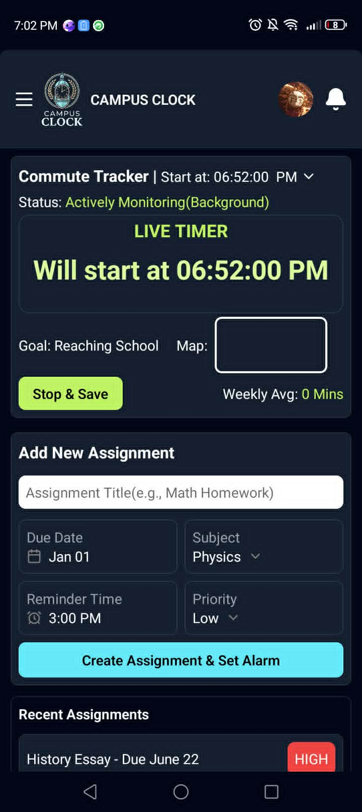
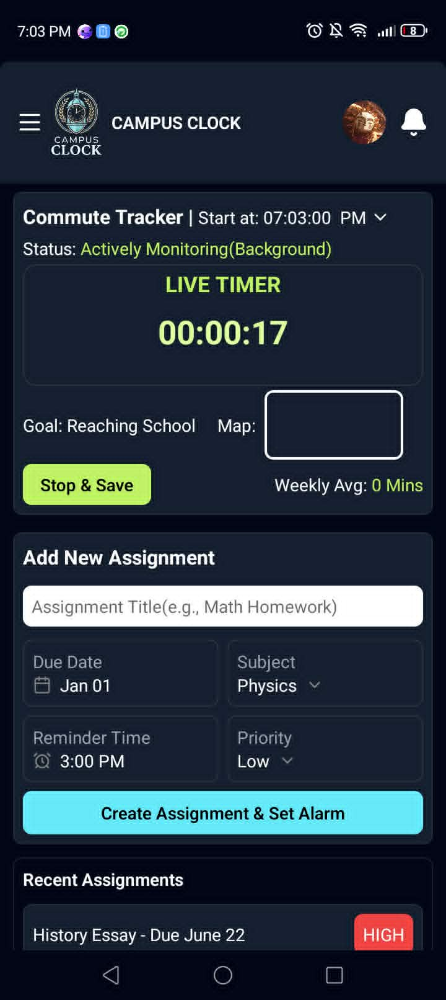
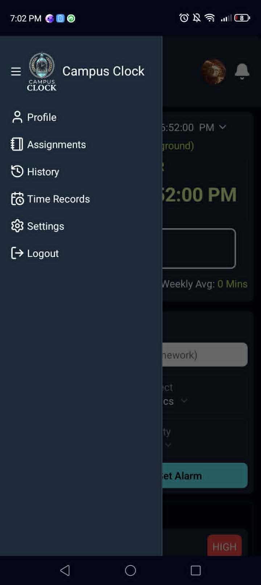
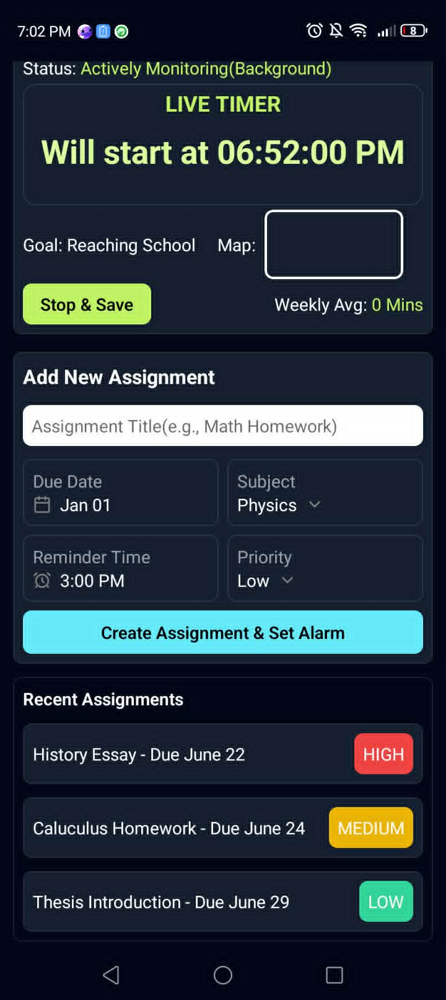
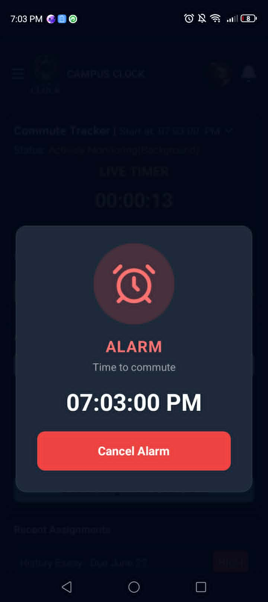

# ⏰ Campus Clock 🏫

Campus Clock is a student app that is built with React Native, Expo, and Node.JS + Express.JS for backend. It is meant to be a tracker that gives you information so that you know what's the best time to get up for school. It also features an assignments tab for your assignments, and in the future will feature a to-do list with a functioning journal.

### 📷 Main Page(Timer hasn't gone off yet)

### 📷 Main Page(Timer has gone off)

### 📷 Left Sidebar

### 📷 Bottom Part of the Main Page

### 📷 Alarm UI

